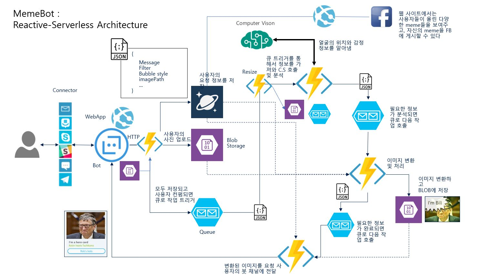

# MemeBot
짤방(Meme)을 생성해주는 봇을 만들어보는 프로젝트 입니다.
[Microsoft CSE Hackaton](https://garagehackbox.azurewebsites.net/hackathons/1106/projects/69246)에서 사용할 프로젝트 입니다. :)

### 짤방이란? 
어원은 "짤림 방지". 줄여서 '짤'이라고도 부른다. JPG라 쓰고 JAL이라 읽는다

인터넷 공간 속에서 돌고 도는 각종 "자투리 이미지 파일.JPG"에 대한 통칭이다. 디시인사이드나 웃긴대학 등 소위 유머 사이트에서 언급되는 빈도가 특히 높은 것도 사실이나, 그보다도 한국 인터넷 어느 사이트에서도 어떻게든 언급되는 것을 발견할 수 있을 정도로 대단히 대중적인 단어가 된 인터넷 은어에 해당한다.

출처: [나무위키](https://namu.wiki/w/%EC%A7%A4%EB%B0%A9)

## Architecture

Hackaton에서 만들어 볼 Bot의 아키텍처 입니다. 김태영 부장님께서 작성하시느라 수고해 주셨습니다. :)

## 역할 분담

* yschoi : 오케스트레이션 
* hyeryu : 말풍선 이미지 찾기, 문서 작업 
* hyeryu, eunk : Vision API 이용하여 얼굴 이미지 확인 후 결과 값 전달 (Work with - taeyok, hchoi)
* taeyok : 이미지 프로세싱, 캐로우슬 이미지 작업 (Work with - hchoi, eunk)
* hchoi, yowkim : 챗봇 만들기, 프로 액티브 작업 (Work with - All)
* mib : 페이스북과 연동 서비스 만들기, 웹앱 (Work with - hchoi)
* sjbaek : 도커로 배포 (Work with - mib)

## 제약사항 

챗봇을 통해 Meme을 만들때에는 모든 경우를 고려할 수 없기 때문에 이미지 크기나 글자의 수에 한계가 있습니다.
제약사항은 다음과 같으며, 추후 계속적으로 업데이트 할 예정입니다. 

* 이미지 
    * 최소 사이즈 : 500
    * 권장 : 텍스트 20자 내
    * 버블 위치 : TopL, TopR, BottomL, BottonR
    * 버블 종류 : 원, 구름, 스타
    * 필터 : 약 8가지 
    * 이미지 유형 : JPG, PNG

