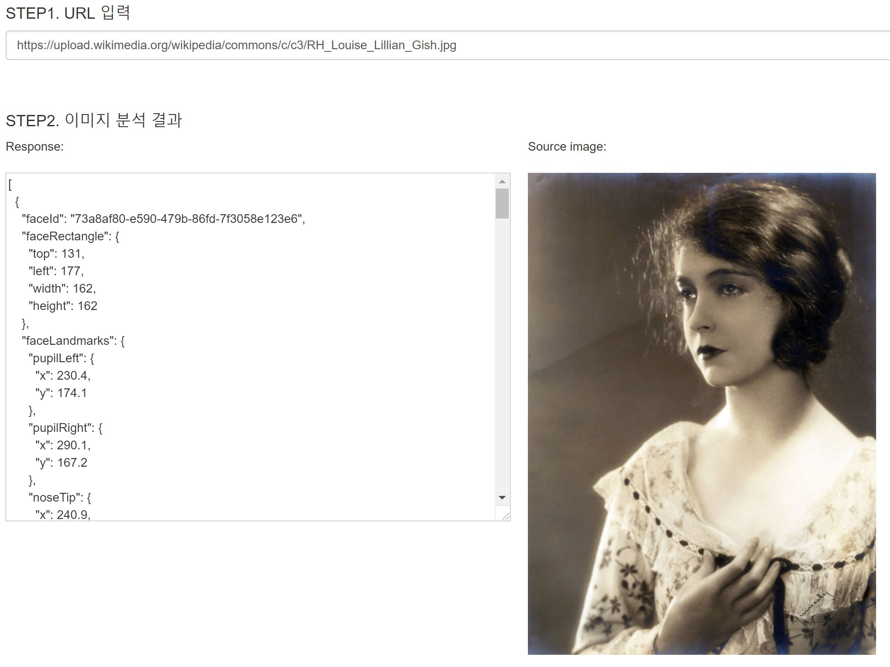
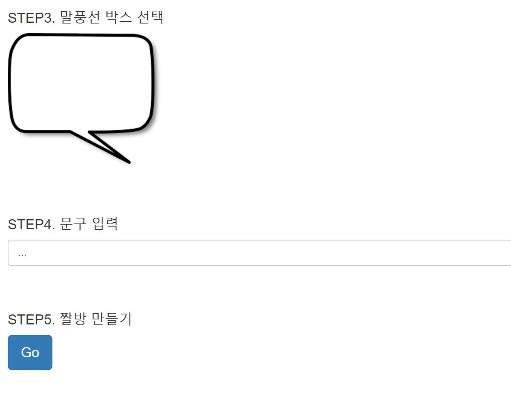
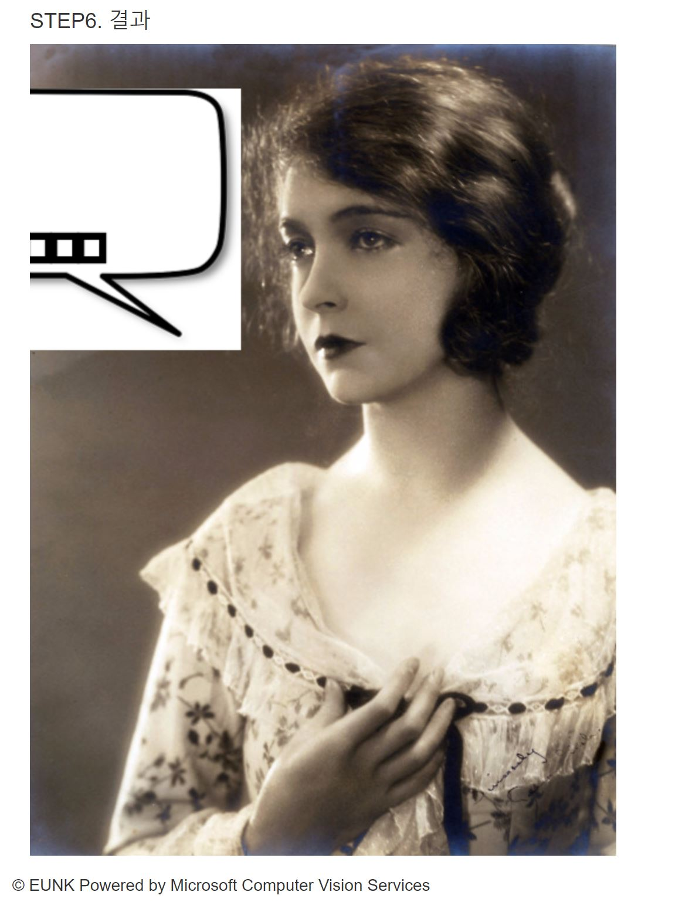

# MemeBot
짤방(Meme)을 생성해주는 봇을 만들어보는 프로젝트 입니다.
[Microsoft CSE Hackaton](https://garagehackbox.azurewebsites.net/hackathons/1106/projects/69246)에서 사용할 프로젝트 입니다. :)

### 짤방이란? 
어원은 "짤림 방지". 줄여서 '짤'이라고도 부른다. JPG라 쓰고 JAL이라 읽는다

인터넷 공간 속에서 돌고 도는 각종 "자투리 이미지 파일.JPG"에 대한 통칭이다. 디시인사이드나 웃긴대학 등 소위 유머 사이트에서 언급되는 빈도가 특히 높은 것도 사실이나, 그보다도 한국 인터넷 어느 사이트에서도 어떻게든 언급되는 것을 발견할 수 있을 정도로 대단히 대중적인 단어가 된 인터넷 은어에 해당한다.

출처: [나무위키](https://namu.wiki/w/%EC%A7%A4%EB%B0%A9)

## Demo용 웹서비스

* [http://memeservice.azurewebsites.net/service/index.html](http://memeservice.azurewebsites.net/service/index.html)

